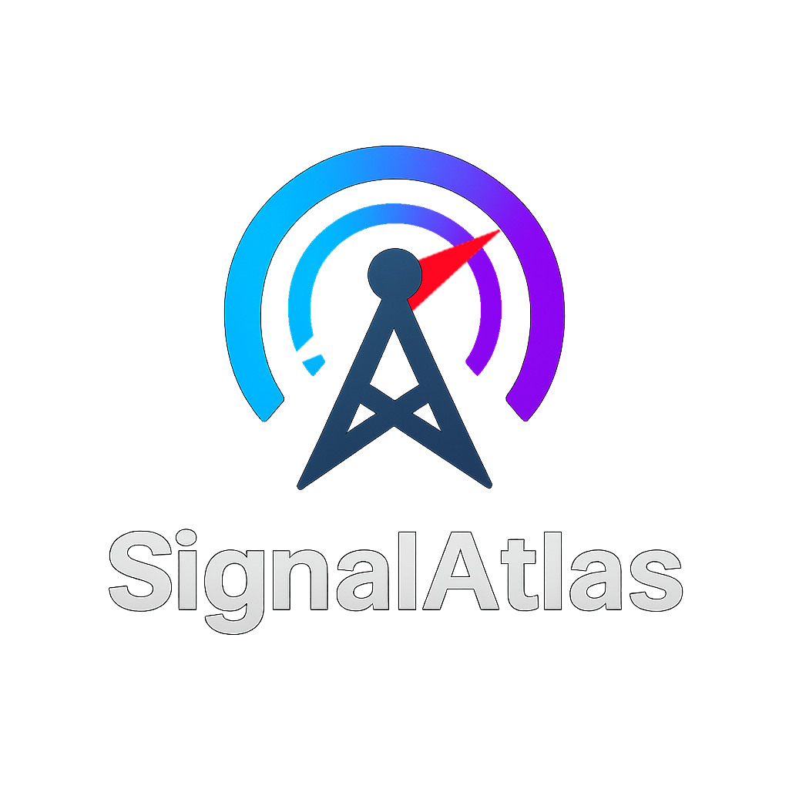

<p align="center">
  
</p>

# SignalAtlas

**SignalAtlas** is an interactive, zoomable web visualization of the entire known radio frequency spectrum. It allows users to explore frequency bands, navigate through standard band regions (like VHF/UHF), search specific frequencies, and view allocations sourced from publicly available spectrum charts.  
Check it out here: [https://imagineer7.github.io/SignalAtlas/](https://imagineer7.github.io/SignalAtlas/)

> Built with React + D3.js • Styled for dark mode • Features dynamic zoom & frequency resolution

---

### Features

- Zoomable and pannable view of the RF spectrum (from Hz to hundreds of GHz)
- Frequency band overlays (e.g., VHF, UHF, SHF)
- Allocation zones with optional labels (e.g., Amateur Radio, Wi-Fi, Satellite)
- Search bar to go directly to a known frequency (supports `kHz`, `MHz`, `GHz`)
- Clickable zoom-to-band buttons
- **Interactive Sub-Band Visualizer**:
  - Click a detailed band to reveal its internal sub-bands (e.g., CW, SSB, Digital)
  - Animated, color-coded bar visual for sub-band segments
  - Dynamic label placement with connector lines if space is tight
  - Automatically generated mode legends
  - Frequency ticks and summary table for clarity
- Dark-mode optimized interface

---

### 🛠️ Installation & Setup

```bash
# Clone the repo
git clone https://github.com/yourusername/signalatlas.git
cd signalatlas

# Install dependencies
npm install

# Start the dev server
npm start
